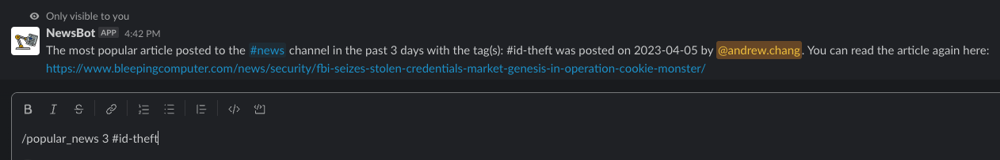

# newsbot
A URL harvesting bot for Slack. Will also send weekly roundups for the links sent in the channel with a summary of the most popular article of the week (based on number of interactions it gets in the channel) using the SMMRY API.


## Usage in Slack
Mention NewsBot with a URL and description to be ingested by NewsBot e.g. `@NewsBot http://www.example.com this is an example url #tag`. 

NewsBot will then save the following information:

* Message ID
* URL
* All the text (before or after the URL)
* Sender ID
* Channel ID
* Date it was sent
* Team ID


NewsBot _will_ publicly shame you if you give it an already-uploaded URL.


Furthermore, you can use the `/popular_news` slash command in the channel with NewsBot for quickly looking up popular news within a user-defined number of days with optional tags.
```
Usage: /popular_news num_days hashtags
A command to search for the most popular news articles posted in the current channel.
Popularity is evaluated by overall number of interactions (reactions, replies, etc.)

Arguments:
num_days    optional    number of days back to search for most popular news links (default: 7)
hashtags    optional    comma-separated list of hashtags to search with no spaces (i.e. #breach,#ransomware)
```



### Credit
Original project by Pascal Issa for Webex integration.
